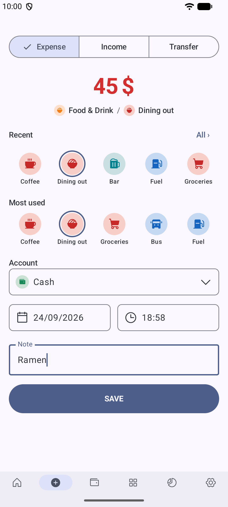
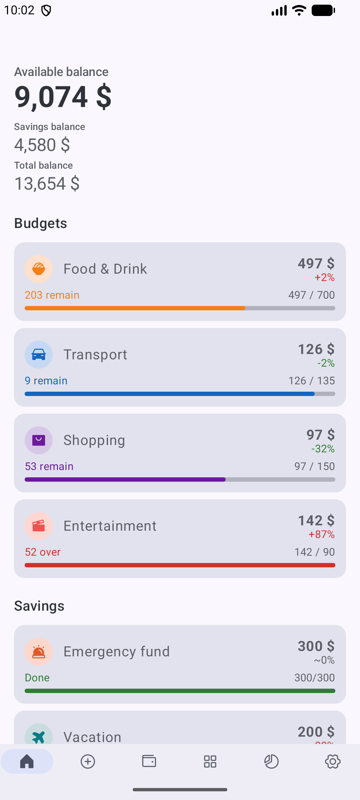
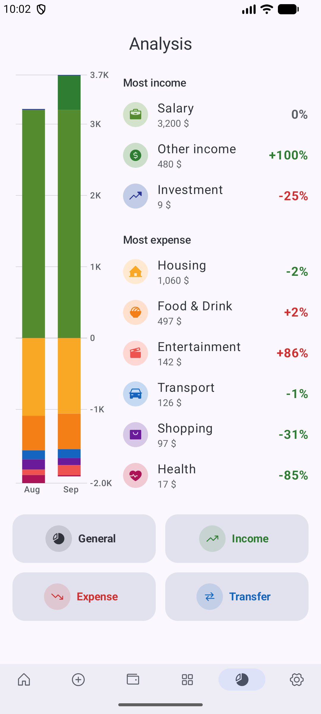
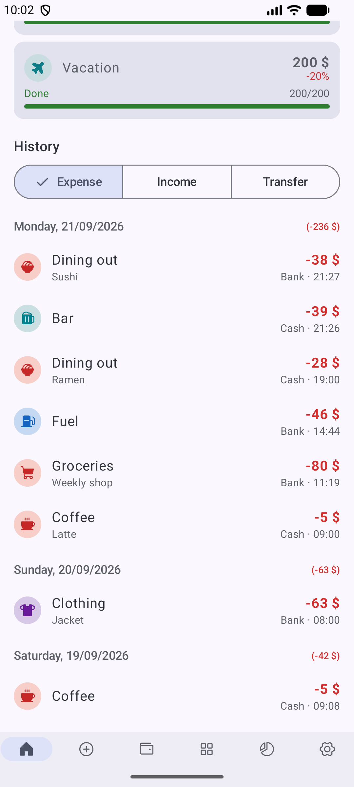
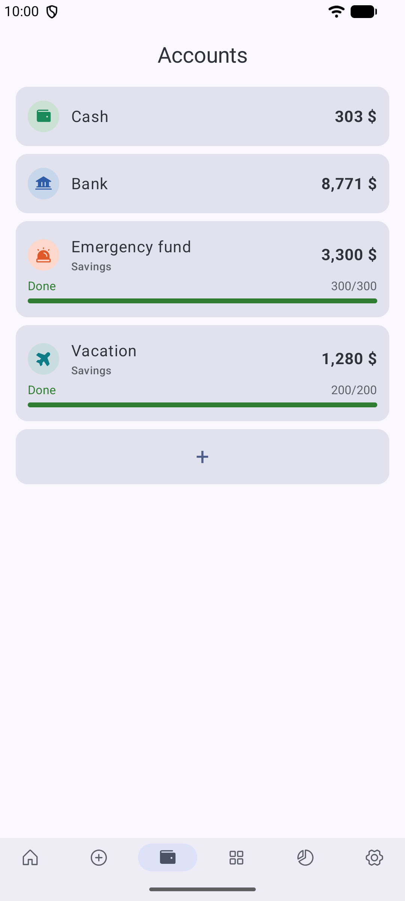
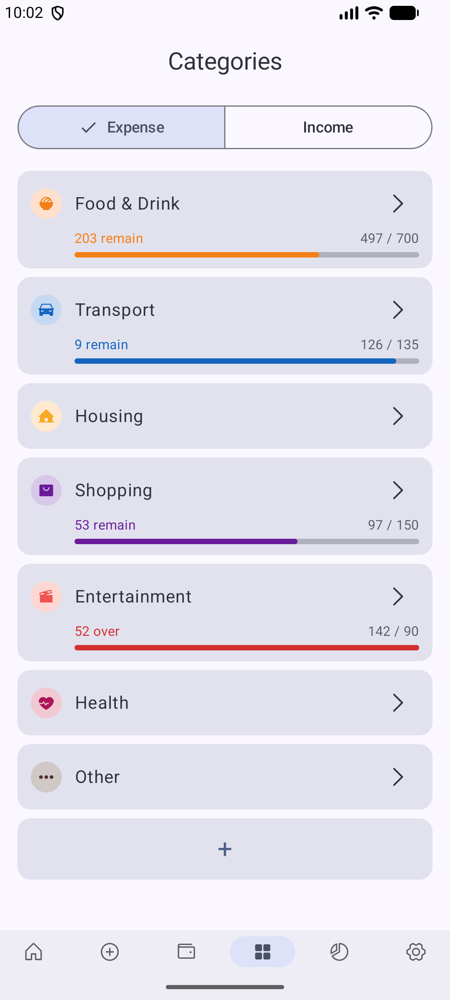
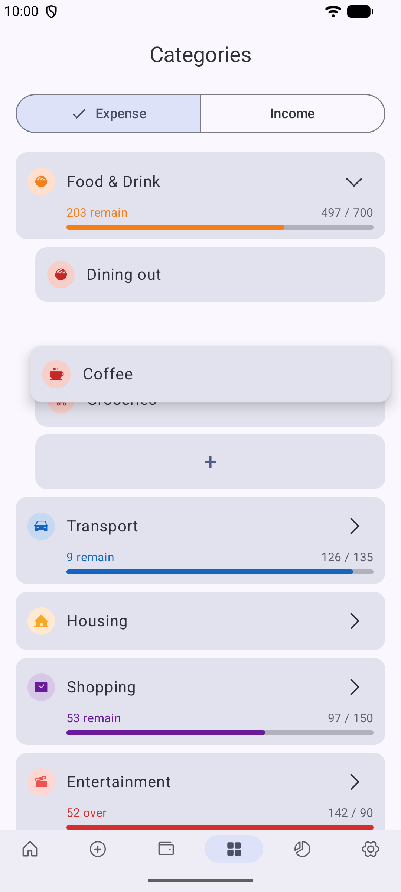

<div align="center">

# Outgo

**A lightweight, fast-starting expense tracker for Android.**

Open the app and you are already on the "add expense" screen. Log a purchase in a few taps.

[](https://github.com/ngth1010v/Outgo/releases/latest)
[](LICENSE)


&nbsp;
&nbsp;


</div>

## Features

### Quick entry


- **The app opens on the add screen.** You do not have to go through a dashboard to log an expense.
- **Expense, Income and Transfer** use the same form. Swipe left or right to switch between them.
- **Smart category grid:** one row shows your 5 most recent categories, and one row shows your 5 most used. Most entries take one tap. **All ›** opens the full category list, which you can search.
- Pick the account, date, time and an optional note. After you tap **Save**, the form resets and a snackbar offers **Undo**.

<br clear="right" />

### Home dashboard


- **Available, savings and total balance** at a glance.
- **Budgets** for this month: amount spent, amount remaining or over, and the change against last month. They are listed in the same order as your categories.
- **Savings** progress toward each savings account's monthly target, in the same order as your accounts.
- **History** grouped by day with daily totals. You can filter by Expense, Income or Transfer. Tap a transaction to edit it or delete it.

<br clear="right" />

<p align="center">
  
</p>

### Accounts and savings



- Keep several accounts, for example cash, bank and e-wallet, each with its own icon and color.
- **Savings accounts** can have a monthly target, and a progress bar tracks it. The bar turns green when you reach the target.
- Edit an account's balance directly. Outgo records the difference as a balance adjustment, so the balance always matches the transaction history.
- Accounts that have history are archived, not deleted, so past records stay correct.
- **Drag to reorder:** long-press an account, drag it to a new place and let go. The same order is used on Home and in the account picker.

<br clear="right" />

### Categories and budgets



- **Two-level categories** (parent and subcategory) for both expense and income. A default set is created on first launch.
- Set a **monthly budget** on any expense category. A parent budget counts the spending of all its subcategories.
- The progress bar shows the remaining amount. It turns red with an "over" amount when you exceed the budget.
- **105 built-in icons**, or **import your own PNG**. Imported icons are stored in the database, so they are included in backups.

<br clear="right" />

#### Drag to reorder



- **Long-press** a category or subcategory to lift it. Drag it, and the other rows move aside to show where it will land. Let go to drop it there.
- Categories move among categories. While you drag one, all categories fold so the list is short.
- Subcategories move within their category or into another one. Hold a subcategory over a folded category for a moment and it opens, so you can drop the subcategory inside. The subcategory's past transactions and budget spending move with it.
- A category's only subcategory can't be moved out of it.
- The list scrolls when you drag near its top or bottom edge.

<br clear="right" />

### Analysis


- **One page per month and one per year**, swiped through or stepped with the year and month pickers in the top bar. Swipe right off December to reach that year's summary.
- **Categories / Accounts**, two tabs under the pickers. Each is a list of charts you arrange: long-press a chart to drag it, drop it on the red strip at the right edge to remove it (with undo), and add charts back from the + button at the bottom. Month and year pages keep separate lists, saved in the database so they travel with backups.
- **Expense / Income / All** is picked per chart, from the chip in its title. All draws both kinds together rather than a single net figure.
- **Month summary:** the total signed as money flows (spending −, income +, net in All mode), the change against last month in amount and percent, the average per day, and money moved between accounts.
- **Where the money went:** a donut and a category breakdown, a 6-month trend, and the biggest movers against last month.
- **When it went:** a cumulative spending pace line against last month, a daily heatmap that opens that day's history, and the average spend per weekday.
- **What it went on:** the mix of purchase sizes around the month's median, and the five largest movements.
- **Accounts tab:** spending and income per account (donut and breakdown), each account's net flow, month-end balance lines, transfers summed per account pair, and the largest movements of one chosen account.
- **Yearly analysis:** year summary, month-by-month bars, category totals for the year, and this year against last year. A part-finished year is compared against the same months a year earlier, never against a full twelve.

<br clear="right" />

### Settings and data

- **English and Vietnamese**, chosen in the app or taken from the system language.
- **Currency symbol:** pick one of 20 common currencies, or type your own.
- **Backup and restore to one `.sqlite` file.** All your data is in that file: accounts, categories, transactions, budgets, settings and imported icons. A restore keeps a safety copy of your current data on the device first.
- **Offline and private.** No account, no network, no ads. Your data stays on your phone.

## Download

1. Go to the [Releases page](https://github.com/ngth1010v/Outgo/releases/latest).
2. Download `Outgo.apk` from the latest release.
3. Open the downloaded file on your Android phone to install it.
   - The first time, Android asks for permission to install apps from this source. Allow it, then tap **Install**.
4. Open **Outgo** from your app drawer.

Requires Android 11 (API 30) or newer.

> **Updating from v1.5.1 or older?** Starting with v1.6.0, releases are signed with a new key, so Android will not install v1.6.0 over an older version. First export a backup in **Settings → Export backup**. Then uninstall the old app, install the new one, and use **Settings → Restore from backup**. Later versions will install over v1.6.0 normally.

## Build from source

Requirements: JDK 17+ and the Android SDK (`ANDROID_HOME` or `local.properties`).

```bash
build.bat            # debug APK   -> app\build\outputs\apk\debug\app-debug.apk
build.bat release    # release APK (R8 minified; needs a signing config, see below)
build.bat clean      # clean, then debug APK
```

Or run Gradle directly: `gradlew.bat assembleDebug`, `gradlew.bat assembleRelease`.

### Release signing

`build.bat release` signs with the keystore named by `keystore.properties`. Both that file and the
`keystore/` directory are gitignored: a signing key in a public repository lets anyone build an APK
that Android installs straight over yours as an update. Without them the build still succeeds, but
the APK is unsigned and will not install.

Create your own once:

```bash
keytool -genkeypair -v -keystore keystore/outgo-release.jks -alias outgo \
        -keyalg RSA -keysize 4096 -validity 10000
```

Then write `keystore.properties` in the repository root (`storeFile` is resolved from there):

```properties
storeFile=keystore/outgo-release.jks
storePassword=…
keyAlias=outgo
keyPassword=…
```

Keep that keystore backed up somewhere private. Losing it means existing installs can never be
updated — they have to be uninstalled first, and Outgo keeps its data on the device only. For CI,
hold the keystore as a base64 secret and write both files during the job rather than committing
them. For Google Play, enrol in Play App Signing and keep this key as the private *upload* key.

Check what a build actually produced:

```bash
apksigner verify --verbose app\build\outputs\apk\release\app-release.apk
```

## Under the hood

- **Kotlin, Jetpack Compose and Material 3.** A single-activity app with no DI framework and no image-loading library.
- **One SQLite file (Room).** Money is stored as `Long` in the smallest currency unit, never as floating point. SQL triggers maintain balances, monthly category totals and category usage counts.
- **Fast cold start.** The first frame draws before the database opens. A committed **Baseline Profile** AOT-compiles the startup path and every animated transition.

See [architecture.md](architecture.md) for the full design (in Vietnamese): data model, triggers, screens, backup format and performance budget.

## License

[MIT](LICENSE) © ngth1010v. Navigation and UI icons are based on [Phosphor Icons](https://phosphoricons.com) (MIT).
