# Outgo — Kiến trúc hệ thống

> App Android quản lý chi tiêu: **nhẹ, mở nhanh, mở ra là vào thẳng màn "Thêm giao dịch"**.
> Toàn bộ dữ liệu người dùng nằm trong **một file SQLite duy nhất** để backup/restore chỉ bằng một lần copy.

## Mục lục

1. [Mục tiêu & ràng buộc](#1-mục-tiêu--ràng-buộc)
2. [Các quyết định chính](#2-các-quyết-định-chính)
3. [Tổng quan kiến trúc](#3-tổng-quan-kiến-trúc)
4. [Khởi động nhanh](#4-khởi-động-nhanh)
5. [Dữ liệu: một file SQLite](#5-dữ-liệu-một-file-sqlite)
6. [Navigation](#6-navigation)
7. [Các màn hình](#7-các-màn-hình)
8. [Icon: import PNG khi đang chạy](#8-icon-import-png-khi-đang-chạy)
9. [Backup & Restore](#9-backup--restore)
10. [Lịch sử giao dịch lớn](#10-lịch-sử-giao-dịch-lớn)
11. [Hiệu năng: chỉ tiêu & kỹ thuật](#11-hiệu-năng-chỉ-tiêu--kỹ-thuật)
12. [Kiểm thử](#12-kiểm-thử)
13. [Lộ trình](#13-lộ-trình)
14. [Giả định & câu hỏi mở](#14-giả-định--câu-hỏi-mở)

---

## 1. Mục tiêu & ràng buộc

| # | Yêu cầu | Hệ quả thiết kế |
|---|---------|-----------------|
| R1 | Một file `.sqlite` chứa toàn bộ dữ liệu người dùng | Icon người dùng import lưu dạng **BLOB trong DB**; setting cũng lưu trong DB |
| R2 | Mở app thật nhanh | Không dùng DI framework, không dùng thư viện chart/ảnh, có Baseline Profile, frame đầu tiên **không chờ DB** |
| R3 | Mở ra vào thẳng màn Trade | `startDestination = Trade` |
| R4 | Nhiều tài khoản, danh mục cha/con, budget, mục tiêu tiết kiệm | Schema quan hệ, xem [§5](#5-dữ-liệu-một-file-sqlite) |
| R5 | Lịch sử giao dịch lớn | Số liệu tổng hợp do **trigger** tự cập nhật, danh sách phân trang theo **keyset** |
| R6 | Icon PNG import khi đang chạy | Pipeline chuẩn hoá, dedupe bằng SHA-256, cache bitmap trong RAM |
| R7 | Tập trung vào chi | Mặc định là **Chi**, budget chỉ áp cho danh mục chi |

**Ngoài phạm vi (v1):** đồng bộ cloud, nhiều loại tiền, chuyển tiền giữa tài khoản, giao dịch định kỳ, trang Analysis.

---

## 2. Các quyết định chính

| Hạng mục | Lựa chọn | Lý do |
|----------|----------|-------|
| Ngôn ngữ / UI | Kotlin 2.x + Jetpack Compose (Material 3) | Một Activity, không có XML inflate, dễ đo và tối ưu bằng Baseline Profile |
| DB | Room trên **SQLite có sẵn của Android** | Không kèm thư viện native nên APK nhẹ và khởi động nhanh |
| minSdk | **30** (Android 11, SQLite ≥ 3.28) | Có sẵn `VACUUM INTO` (3.27), row-value (3.15), window function (3.25) |
| DI | Thủ công (`AppContainer`, khởi tạo `lazy`) | Hilt/Koin tốn thời gian ở bước khởi động |
| Navigation | Navigation Compose (route type-safe) | Chuẩn, hỗ trợ lưu/khôi phục state của từng tab |
| Bất đồng bộ | Coroutines + Flow | Room trả về `Flow` và tự phát lại khi bảng thay đổi |
| Chart | Tự vẽ bằng Compose `Canvas` | Chỉ có 1 dạng chart, thêm thư viện là thừa |
| Ảnh icon | Tự giải mã + `LruCache<Long, ImageBitmap>` | Coil/Glide quá nặng cho vài chục icon 128px |
| Icon điều hướng | Phosphor SVG chuyển thành VectorDrawable lúc build | Không dùng `material-icons-extended` (rất nặng) |
| Tiền | `Long` theo đơn vị nhỏ nhất (VND = đồng) | Không có sai số dấu phẩy động |
| Thời gian | `occurred_at` (epoch ms UTC) + `month_key` (yyyyMM, giờ địa phương) | Truy vấn theo tháng bằng số nguyên, có index |
| Module | 1 module `:app` + `:baselineprofile` | App nhỏ, tách nhiều module chỉ thêm độ phức tạp |

---

## 3. Tổng quan kiến trúc

### 3.1 Các lớp

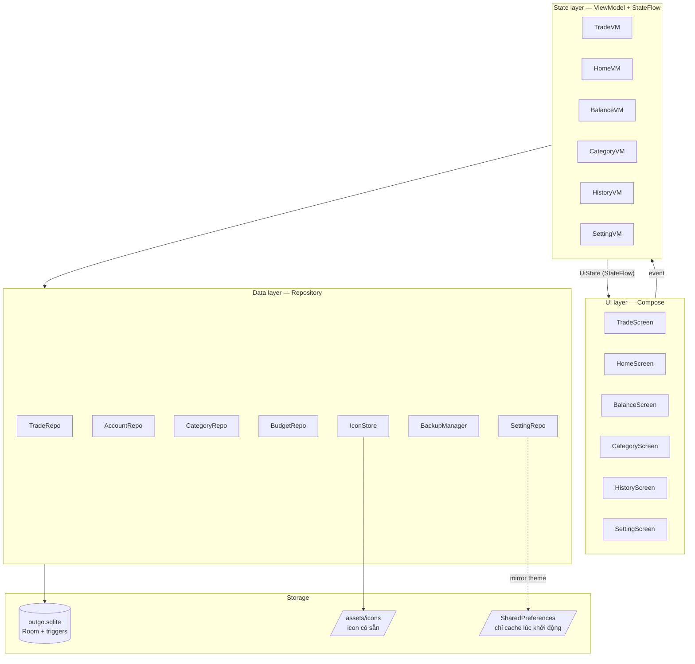

**Nguyên tắc:**

- **Dữ liệu chỉ chảy một chiều:** UI gửi event, ViewModel xử lý và phát ra `UiState`.
- Repository chỉ trả `Flow` hoặc `suspend fun`, không bao giờ chạy trên main thread.
- **Không có lớp UseCase riêng.** Logic nghiệp vụ nằm trong Repository, còn phần liên quan đến số dư và thống kê nằm trong **trigger SQL**.
- `SharedPreferences` **không** chứa dữ liệu người dùng. Nó chỉ giữ bản sao của theme và locale để frame đầu vẽ đúng màu mà không phải mở DB.

### 3.2 Cấu trúc package

```text
app/src/main/java/app/outgo/
├── OutgoApp.kt                 # Application: tạo AppContainer, mở DB trước ở background
├── MainActivity.kt             # single activity, setContent { OutgoRoot() }
├── di/AppContainer.kt          # DI thủ công, mọi thứ đều lazy
├── data/
│   ├── db/                     # OutgoDatabase, Entities, DAOs, Migrations, Triggers.kt
│   ├── repo/                   # TradeRepo, AccountRepo, CategoryRepo, BudgetRepo, SettingRepo
│   ├── icon/                   # IconStore, IconImporter, IconCache
│   └── backup/                 # BackupManager, RestoreValidator
├── ui/
│   ├── nav/                    # Routes, OutgoNavHost, BottomBar
│   ├── theme/                  # màu, typography, BudgetColors
│   ├── component/              # AmountField, IconGrid, BudgetProgress, PlusRow, EditSheet
│   ├── trade/  home/  balance/  category/  history/  analysis/  setting/
└── util/                       # MoneyFormat, MonthKey, Clock
app/src/main/assets/icons/      # icon có sẵn (PNG)
app/src/main/res/drawable/      # ph_*.xml (Phosphor vector cho bottom bar)
baselineprofile/                # Macrobenchmark + BaselineProfileGenerator
```

### 3.3 Đồ thị phụ thuộc (DI thủ công)

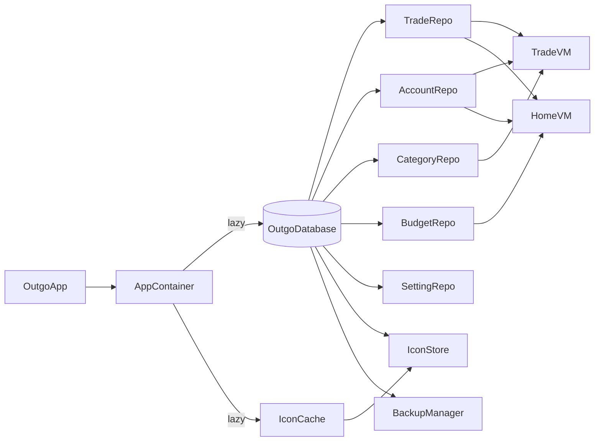

---

## 4. Khởi động nhanh

### 4.1 Chiến lược

Vấn đề chính của cold start là **Compose phải biên dịch JIT lần đầu** và **việc mở DB**. Cách xử lý:

1. **Baseline Profile + Startup Profile.** Các đường code của màn Trade được biên dịch AOT sẵn, giảm khoảng 30–40% thời gian frame đầu.
2. **Frame đầu không phụ thuộc DB.** Màn Trade gồm các phần tĩnh (nút Thu/Chi, ô tiền `0`, ngày giờ hiện tại) và các **ô giữ chỗ có kích thước cố định** cho lưới danh mục. Khi dữ liệu về, giao diện không bị nhảy layout.
3. **Mở DB song song.** `OutgoApp.onCreate` chạy `appScope.launch(IO) { db.openHelper.writableDatabase }` trong lúc Activity dựng UI.
4. **Một truy vấn duy nhất cho màn Trade.** Danh mục gần đây, danh mục dùng nhiều và danh sách tài khoản được lấy trong một transaction đọc.
5. **Không có công việc thừa trong `Application`:** không dùng App Startup, không khởi tạo WorkManager, không bật analytics.
6. Build với R8 full mode, `isShrinkResources = true`, chỉ giữ ngôn ngữ `vi`/`en`.

### 4.2 Trình tự cold start

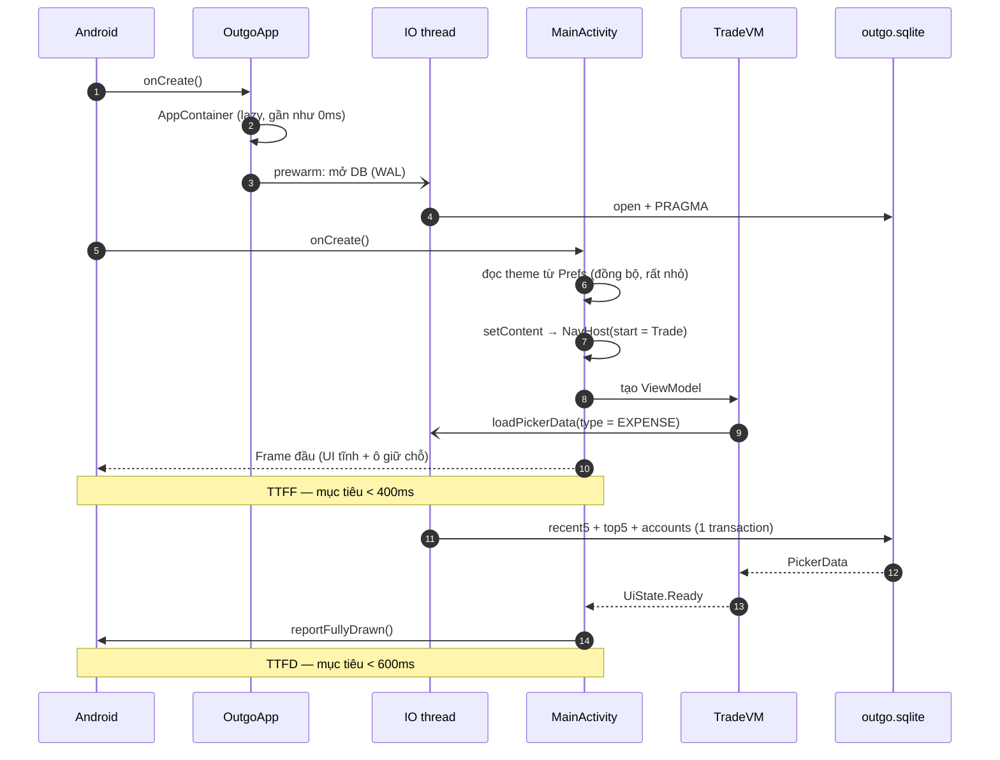

### 4.3 Ngân sách thời gian (máy tầm trung, cold start)

```mermaid
gantt
    title Ngân sách cold start (ms)
    dateFormat x
    axisFormat %L
    section Hệ thống
    Tạo process + bindApplication :a1, 0, 150
    section App
    OutgoApp.onCreate             :a2, 150, 170
    Activity + setContent         :a3, 170, 280
    Compose frame đầu             :a4, 280, 380
    section Nền
    Mở DB (song song)             :b1, 170, 260
    Truy vấn picker               :b2, 280, 320
    section Hoàn tất
    Hiển thị dữ liệu + fullyDrawn :a5, 380, 450
```

---

## 5. Dữ liệu: một file SQLite

### 5.1 File và tên

- Đường dẫn: `/data/data/app.outgo/databases/outgo.sqlite`
- `PRAGMA application_id = 0x4F55544F` (chữ "OUTO") dùng để nhận diện file khi restore.
- `PRAGMA user_version` do Room quản lý, là **phiên bản schema**.
- `journal_mode = WAL`, `synchronous = NORMAL`, `foreign_keys = ON`.

> **Về chữ "một file":** khi app đang chạy, WAL tạo thêm hai file tạm `-wal` và `-shm`. Đây là file vận hành, **không phải dữ liệu riêng**. Khi backup, app dùng `VACUUM INTO` nên file xuất ra **luôn là một file duy nhất và nhất quán** (xem [§9](#9-backup--restore)).

### 5.2 Sơ đồ quan hệ

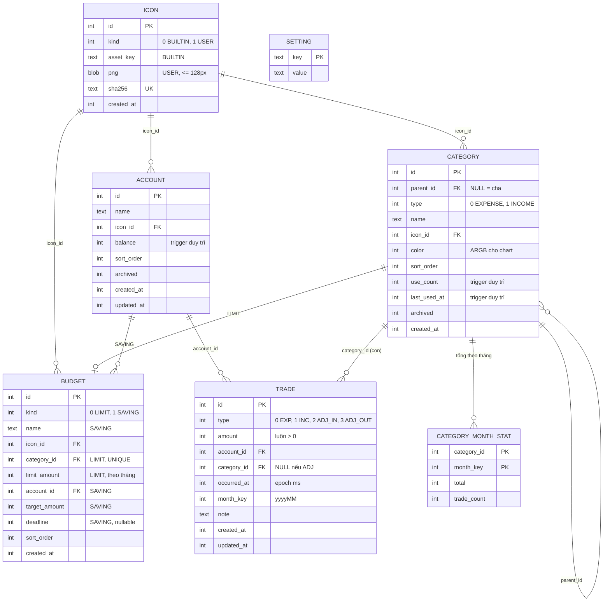

**Quy tắc dữ liệu:**

| Quy tắc | Cách đảm bảo |
|---------|--------------|
| `amount` luôn dương, dấu được suy ra từ `type` | `CHECK (amount > 0)`, ô nhập tiền chặn dấu `-` |
| Giao dịch Thu/Chi chỉ gắn vào **danh mục con** | Kiểm tra ở `TradeRepo` và `CHECK` cho `category_id` |
| Danh mục con có cùng `type` với danh mục cha | Kiểm tra ở `CategoryRepo` (cây Thu và cây Chi tách riêng) |
| Chỉnh "số dư hiện tại" của tài khoản | Tạo giao dịch `ADJ_IN`/`ADJ_OUT` với phần chênh lệch, **không** ghi đè `balance` |
| Danh sách Chi và Thu riêng biệt | Lọc theo `type`, dùng index `(type, occurred_at, id)` |
| Mỗi danh mục có tối đa 1 budget LIMIT | `UNIQUE(category_id)` |

### 5.3 Trigger là nguồn sự thật cho số liệu tổng hợp

Ba giá trị `account.balance`, `category_month_stat` và `category.use_count/last_used_at` **chỉ được thay đổi bởi trigger** trên bảng `trade`. Nhờ vậy, dù ghi dữ liệu từ đâu (màn Trade, sửa lịch sử, restore, migration), số liệu **không bao giờ bị lệch**.

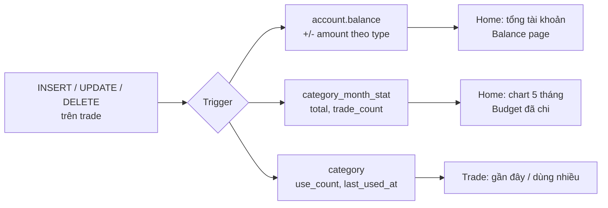

Với `UPDATE`, trigger **hoàn tác bản ghi OLD rồi áp dụng bản ghi NEW**, nên đổi tài khoản, danh mục, tháng hay số tiền đều cho kết quả đúng.

<details>
<summary><b>DDL + trigger đầy đủ</b> (đã chạy thử trên SQLite: 20k insert, 3k update, 3k delete ngẫu nhiên, sau đó so với kết quả tính lại từ đầu và khớp hoàn toàn)</summary>

```sql
PRAGMA foreign_keys = ON;

CREATE TABLE icon (
  id          INTEGER PRIMARY KEY,
  kind        INTEGER NOT NULL,            -- 0 = BUILTIN, 1 = USER
  asset_key   TEXT,
  png         BLOB,
  sha256      TEXT UNIQUE,
  created_at  INTEGER NOT NULL,
  CHECK ((kind = 0 AND asset_key IS NOT NULL) OR (kind = 1 AND png IS NOT NULL))
);

CREATE TABLE account (
  id          INTEGER PRIMARY KEY,
  name        TEXT    NOT NULL,
  icon_id     INTEGER REFERENCES icon(id) ON DELETE SET NULL,
  balance     INTEGER NOT NULL DEFAULT 0,
  sort_order  INTEGER NOT NULL DEFAULT 0,
  archived    INTEGER NOT NULL DEFAULT 0,
  created_at  INTEGER NOT NULL,
  updated_at  INTEGER NOT NULL
);

CREATE TABLE category (
  id            INTEGER PRIMARY KEY,
  parent_id     INTEGER REFERENCES category(id) ON DELETE RESTRICT,
  type          INTEGER NOT NULL,          -- 0 = EXPENSE, 1 = INCOME
  name          TEXT    NOT NULL,
  icon_id       INTEGER REFERENCES icon(id) ON DELETE SET NULL,
  color         INTEGER NOT NULL,
  sort_order    INTEGER NOT NULL DEFAULT 0,
  use_count     INTEGER NOT NULL DEFAULT 0,
  last_used_at  INTEGER,
  archived      INTEGER NOT NULL DEFAULT 0,
  created_at    INTEGER NOT NULL
);
CREATE INDEX idx_category_recent ON category(type, parent_id, archived, last_used_at DESC);
CREATE INDEX idx_category_top    ON category(type, parent_id, archived, use_count DESC);
CREATE INDEX idx_category_parent ON category(parent_id);

CREATE TABLE trade (
  id           INTEGER PRIMARY KEY,
  type         INTEGER NOT NULL,           -- 0 EXPENSE(-) 1 INCOME(+) 2 ADJUST_IN(+) 3 ADJUST_OUT(-)
  amount       INTEGER NOT NULL CHECK (amount > 0),
  account_id   INTEGER NOT NULL REFERENCES account(id) ON DELETE RESTRICT,
  category_id  INTEGER REFERENCES category(id) ON DELETE RESTRICT,
  occurred_at  INTEGER NOT NULL,
  month_key    INTEGER NOT NULL,
  note         TEXT,
  created_at   INTEGER NOT NULL,
  updated_at   INTEGER NOT NULL,
  CHECK ((type IN (0,1) AND category_id IS NOT NULL) OR (type IN (2,3) AND category_id IS NULL))
);
CREATE INDEX idx_trade_list     ON trade(type, occurred_at DESC, id DESC);
CREATE INDEX idx_trade_account  ON trade(account_id, occurred_at DESC);
CREATE INDEX idx_trade_category ON trade(category_id, created_at DESC);

CREATE TABLE category_month_stat (
  category_id  INTEGER NOT NULL REFERENCES category(id) ON DELETE CASCADE,
  month_key    INTEGER NOT NULL,
  total        INTEGER NOT NULL DEFAULT 0,
  trade_count  INTEGER NOT NULL DEFAULT 0,
  PRIMARY KEY (category_id, month_key)
) WITHOUT ROWID;
CREATE INDEX idx_stat_month ON category_month_stat(month_key);

CREATE TABLE budget (
  id             INTEGER PRIMARY KEY,
  kind           INTEGER NOT NULL,         -- 0 = LIMIT, 1 = SAVING
  name           TEXT,
  icon_id        INTEGER REFERENCES icon(id) ON DELETE SET NULL,
  category_id    INTEGER UNIQUE REFERENCES category(id) ON DELETE CASCADE,
  limit_amount   INTEGER,
  account_id     INTEGER REFERENCES account(id) ON DELETE CASCADE,
  target_amount  INTEGER,
  deadline       INTEGER,
  sort_order     INTEGER NOT NULL DEFAULT 0,
  created_at     INTEGER NOT NULL,
  CHECK ((kind = 0 AND category_id IS NOT NULL AND limit_amount > 0)
      OR (kind = 1 AND account_id IS NOT NULL AND target_amount > 0 AND name IS NOT NULL))
);

CREATE TABLE setting (key TEXT PRIMARY KEY, value TEXT NOT NULL) WITHOUT ROWID;

CREATE TRIGGER trg_trade_ai AFTER INSERT ON trade
BEGIN
  UPDATE account
     SET balance = balance + CASE WHEN NEW.type IN (1,2) THEN NEW.amount ELSE -NEW.amount END,
         updated_at = NEW.updated_at
   WHERE id = NEW.account_id;

  INSERT OR IGNORE INTO category_month_stat(category_id, month_key)
    SELECT NEW.category_id, NEW.month_key WHERE NEW.category_id IS NOT NULL;
  UPDATE category_month_stat
     SET total = total + NEW.amount, trade_count = trade_count + 1
   WHERE category_id = NEW.category_id AND month_key = NEW.month_key;

  UPDATE category
     SET use_count = use_count + 1,
         last_used_at = MAX(COALESCE(last_used_at, 0), NEW.created_at)
   WHERE id = NEW.category_id;
END;

CREATE TRIGGER trg_trade_ad AFTER DELETE ON trade
BEGIN
  UPDATE account
     SET balance = balance - CASE WHEN OLD.type IN (1,2) THEN OLD.amount ELSE -OLD.amount END
   WHERE id = OLD.account_id;

  UPDATE category_month_stat
     SET total = total - OLD.amount, trade_count = trade_count - 1
   WHERE category_id = OLD.category_id AND month_key = OLD.month_key;
  DELETE FROM category_month_stat
   WHERE category_id = OLD.category_id AND month_key = OLD.month_key AND trade_count = 0;

  UPDATE category
     SET use_count = use_count - 1,
         last_used_at = (SELECT MAX(created_at) FROM trade WHERE category_id = OLD.category_id)
   WHERE id = OLD.category_id;
END;

CREATE TRIGGER trg_trade_au AFTER UPDATE ON trade
BEGIN
  UPDATE account
     SET balance = balance - CASE WHEN OLD.type IN (1,2) THEN OLD.amount ELSE -OLD.amount END
   WHERE id = OLD.account_id;
  UPDATE account
     SET balance = balance + CASE WHEN NEW.type IN (1,2) THEN NEW.amount ELSE -NEW.amount END,
         updated_at = NEW.updated_at
   WHERE id = NEW.account_id;

  UPDATE category_month_stat
     SET total = total - OLD.amount, trade_count = trade_count - 1
   WHERE category_id = OLD.category_id AND month_key = OLD.month_key;
  DELETE FROM category_month_stat
   WHERE category_id = OLD.category_id AND month_key = OLD.month_key AND trade_count = 0;
  INSERT OR IGNORE INTO category_month_stat(category_id, month_key)
    SELECT NEW.category_id, NEW.month_key WHERE NEW.category_id IS NOT NULL;
  UPDATE category_month_stat
     SET total = total + NEW.amount, trade_count = trade_count + 1
   WHERE category_id = NEW.category_id AND month_key = NEW.month_key;

  UPDATE category SET use_count = use_count - 1 WHERE id = OLD.category_id;
  UPDATE category SET use_count = use_count + 1 WHERE id = NEW.category_id;
  UPDATE category
     SET last_used_at = (SELECT MAX(created_at) FROM trade WHERE category_id = category.id)
   WHERE id IN (OLD.category_id, NEW.category_id);
END;
```

> Trigger không dùng `UPSERT` hay `RETURNING` nên tương thích với SQLite 3.28 (Android 11).
> Room: khai báo trigger trong `RoomDatabase.Callback.onCreate` và trong mọi `Migration` có đụng tới các bảng liên quan.

</details>

### 5.4 Các truy vấn chính

```sql
-- Home: chart 5 tháng, gộp theo danh mục CHA
SELECT s.month_key, p.id AS root_id, p.type, SUM(s.total) AS total
FROM category_month_stat s
JOIN category c ON c.id = s.category_id
JOIN category p ON p.id = COALESCE(c.parent_id, c.id)
WHERE s.month_key BETWEEN :fromMonth AND :toMonth
GROUP BY s.month_key, p.id;

-- Budget LIMIT: số đã chi tháng này (budget gắn cho cha thì cộng tất cả con)
SELECT b.*, COALESCE((
    SELECT SUM(s.total) FROM category_month_stat s JOIN category c ON c.id = s.category_id
    WHERE s.month_key = :month AND (c.id = b.category_id OR c.parent_id = b.category_id)
  ), 0) AS spent,
  a.balance AS saved                                   -- dùng cho SAVING
FROM budget b LEFT JOIN account a ON a.id = b.account_id
ORDER BY b.kind, b.sort_order;

-- Trade: 5 danh mục con dùng gần đây
SELECT * FROM category
WHERE type = :type AND parent_id IS NOT NULL AND archived = 0 AND last_used_at IS NOT NULL
ORDER BY last_used_at DESC LIMIT 5;

-- Trade: 5 danh mục con dùng nhiều nhất (bỏ những mục đã có ở hàng 1)
SELECT * FROM category
WHERE type = :type AND parent_id IS NOT NULL AND archived = 0 AND use_count > 0
  AND id NOT IN (:recentIds)
ORDER BY use_count DESC LIMIT 5;
```

Các truy vấn trên chỉ đọc bảng tổng hợp và bảng danh mục (vài trăm dòng), nên **không phụ thuộc vào số lượng giao dịch**. Khi chạy thử với 20k giao dịch, truy vấn chart mất khoảng 0.2ms.

---

## 6. Navigation

### 6.1 Bottom navigation

| Thứ tự | Route | Phosphor icon (thường / đang chọn) | Nhãn |
|:-:|------|------------------|------|
| 1 | `home` | `house` / `house-fill` | Tổng quan |
| 2 | `trade` ⭐ start | `plus-circle` / `plus-circle-fill` | Thêm |
| 3 | `balance` | `wallet` / `wallet-fill` | Tài khoản |
| 4 | `category` | `squares-four` / `squares-four-fill` | Danh mục |
| 5 | `analysis` | `chart-pie-slice` / `chart-pie-slice-fill` | Phân tích |
| 6 | `setting` | `gear-six` / `gear-six-fill` | Cài đặt |

- Có 6 mục nên **chỉ hiện nhãn cho tab đang chọn**, các tab khác chỉ có icon, để vừa chiều ngang màn hình hẹp.
- Icon tải từ phosphoricons.com (giấy phép MIT), chuyển SVG sang `res/drawable/ph_*.xml` bằng Android Studio (Vector Asset). Ghi nguồn trong Setting → Giấy phép.
- Khi chuyển tab, dùng `launchSingleTop`, `restoreState` và `popUpTo(trade) { saveState = true }`. Nhấn Back ở tab bất kỳ sẽ về Trade, nhấn Back ở Trade thì thoát app.

### 6.2 Đồ thị route

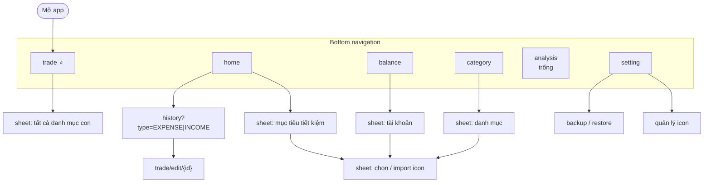

Tất cả popup được hiện bằng `ModalBottomSheet`, không phải route riêng. Nhờ vậy màn phía sau không phải dựng lại và việc đóng/mở tốn ít chi phí.

---

## 7. Các màn hình

### 7.1 Trade (màn khởi động)

#### Wireframe

```text
┌──────────────────────────────────────┐
│   ( ● Chi )          (   Thu   )     │  ← radio ngang, mặc định Chi
│                                      │
│              125.000 ₫               │  ← đậm, to, căn giữa; đỏ khi Chi / xanh khi Thu
│                                      │
│  Gần đây                    Tất cả › │
│  [🍜]   [☕]   [⛽]   [🛒]   [🎬]    │  ← hàng 1: 5 danh mục con dùng gần đây
│  Phở    Cafe   Xăng   Chợ    Phim    │
│  Dùng nhiều                          │
│  [🚌]   [💡]   [📱]   [🍺]   [💊]    │  ← hàng 2: 5 danh mục con dùng nhiều nhất
│  Bus    Điện   4G     Bia    Thuốc   │
│                                      │
│  Tài khoản   [💵 Tiền mặt        ▾]  │
│                                      │
│  ┌───────────────┐ ┌───────────────┐ │
│  │  15/09/2026   │ │     21:30     │ │  ← 2 cột: ngày / giờ
│  └───────────────┘ └───────────────┘ │
│  Ghi chú  [______________________]   │  ← 1 dòng
│                                      │
│  ┌──────────────────────────────────┐│
│  │              LƯU                 ││
│  └──────────────────────────────────┘│
├──────────────────────────────────────┤
│  🏠   ⊕   👛   ▦   ◔   ⚙             │
└──────────────────────────────────────┘
```

#### Trạng thái màn hình

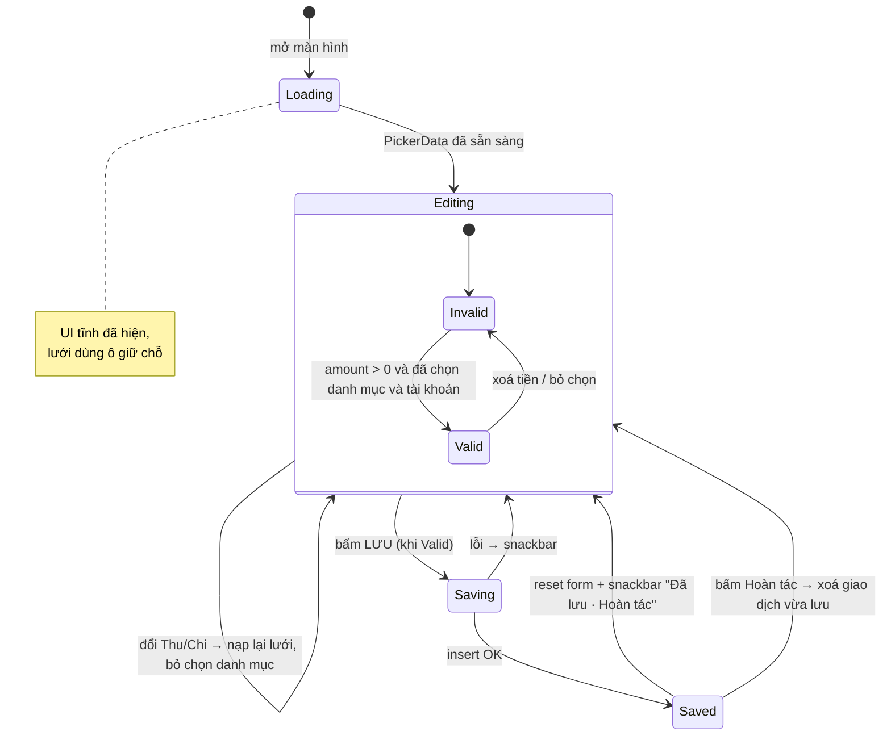

#### Luồng lưu giao dịch

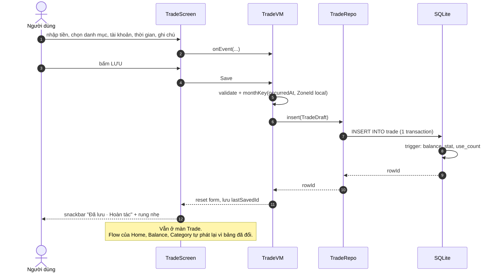

#### Chi tiết từng thành phần

| Thành phần | Hành vi |
|------------|---------|
| **Thu / Chi** | `SingleChoiceSegmentedButtonRow` hoặc 2 `RadioButton` xếp ngang. Mặc định **Chi**. Khi đổi loại, lưới danh mục được nạp lại theo loại mới và danh mục đang chọn bị bỏ. |
| **Số tiền** | `BasicTextField` với `KeyboardType.Number`. Bộ lọc chỉ nhận chữ số nên **không thể nhập số âm**. Tối đa 13 chữ số. `VisualTransformation` hiển thị phân cách hàng nghìn. Font `headlineLarge`, `FontWeight.Bold`, căn giữa. Màu `expenseRed` hoặc `incomeGreen`. Tự focus khi mở màn. |
| **Lưới danh mục** | `2 × 5`, mỗi ô gồm icon 40dp và tên (tối đa 1 dòng, cắt bằng dấu …). Ô đang chọn có viền màu nhấn. |
| **"Tất cả ›"** | Mở sheet chứa toàn bộ cây danh mục của loại đang chọn, dùng khi danh mục cần tìm không nằm trong 10 ô. |
| **Tài khoản** | Dropdown. Mặc định là tài khoản của giao dịch gần nhất, nếu chưa có thì lấy tài khoản đầu tiên. |
| **Ngày / Giờ** | Hai ô ngang nhau. Bấm vào mở `DatePickerDialog` (định dạng `dd/MM/yyyy`) hoặc `TimePickerDialog` (định dạng `HH:mm`, 24h). Mặc định là thời điểm hiện tại. |
| **Ghi chú** | `singleLine = true`, tối đa 100 ký tự. |
| **LƯU** | Nằm cuối trang, chỉ bấm được khi form hợp lệ. Sau khi lưu, **vẫn ở màn Trade** và reset form: tiền = trống, danh mục = chưa chọn, ghi chú = trống, ngày giờ = hiện tại, Thu/Chi = Chi, tài khoản = mặc định. |

#### Thuật toán gợi ý danh mục (2 hàng)

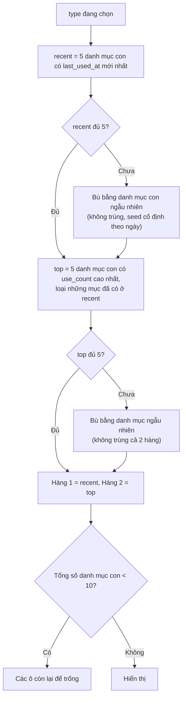

- Phần ngẫu nhiên dùng **seed cố định theo ngày** để các ô không đổi chỗ mỗi lần mở app, người dùng dễ nhớ vị trí hơn.
- Hàng 2 **loại những mục đã có ở hàng 1** để 10 ô luôn là 10 lựa chọn khác nhau. Trên thực tế, danh mục dùng gần đây và dùng nhiều thường trùng nhau. Có thể tắt hành vi này bằng một cờ trong code nếu muốn hiện đúng top 5.

### 7.2 Home

#### Wireframe

```text
┌──────────────────────────────────────┐
│  Tổng tài sản                        │
│  12.450.000 ₫                        │  ← tổng balance các tài khoản chưa lưu trữ
│                                      │
│  Ngân sách                           │
│  🍜 Ăn uống     1.200.000 còn  ▓▓▓▓░ │
│  ⛽ Đi lại        -50.000 còn  ▓▓▓▓▓ │  ← màu theo quy tắc ở §7.4
│  🎯 Du lịch   còn 40.000.000   ▓▓░░░ │  ← SAVING
│  ⊕ Thêm mục tiêu tiết kiệm           │
│                                      │
│  5 tháng gần nhất                    │
│   Thu ▲  ██  ██  ██  ██  ██          │
│          ██  ██  ██  ██  ██          │
│  ────────────────────────── 0        │
│   Chi ▼  ▓▓  ▓▓  ▓▓  ▓▓  ▓▓          │
│          ▒▒  ▒▒  ▒▒  ▒▒  ▒▒          │
│          ░░      ░░  ░░              │
│          T5  T6  T7  T8  T9          │
│                                      │
│  [ Lịch sử Chi ]   [ Lịch sử Thu ]   │
└──────────────────────────────────────┘
```

#### Luồng dữ liệu

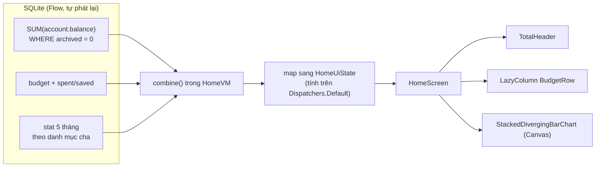

#### Chart cột chồng hai chiều

- **Trục X:** 5 cột, gồm tháng hiện tại và 4 tháng trước (`month_key` từ `M-4` đến `M`). Tháng không có dữ liệu vẫn hiện cột trống.
- **Trên baseline:** các danh mục **cha thuộc loại Thu** xếp chồng lên nhau. **Dưới baseline:** các danh mục **cha thuộc loại Chi** xếp chồng xuống.
- **Thang đo đối xứng:** `maxAbs = max(tổng Thu lớn nhất, tổng Chi lớn nhất)` trong 5 tháng. Baseline nằm ở vị trí tỷ lệ `maxIncome / (maxIncome + maxExpense)` để không lãng phí chiều cao.
- **Thứ tự xếp chồng:** danh mục có tổng 5 tháng lớn hơn nằm gần baseline hơn, và thứ tự này giống nhau ở mọi cột để dễ so sánh.
- **Màu:** lấy từ `category.color`, được gán tự động từ một bảng màu khi tạo danh mục cha.
- **Tương tác:** chạm vào cột hiện tooltip liệt kê từng danh mục và số tiền của tháng đó.
- **Hiệu năng:** chỉ vẽ trong `DrawScope` (tối đa 5 × N hình chữ nhật). Bộ `rect` được tính sẵn trong `remember(data, size)` nên không cấp phát bộ nhớ lúc vẽ.

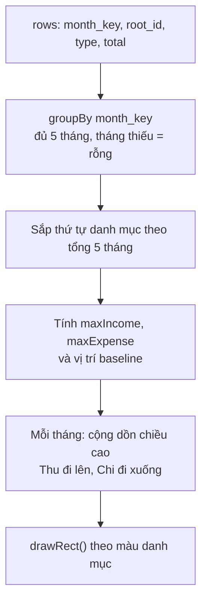

### 7.3 Balance

#### Wireframe

```text
┌──────────────────────────────────────┐
│  💵  Tiền mặt              1.250.000 │  ← trái: icon + tên | phải: số dư (đậm)
│──────────────────────────────────────│
│  🏦  Vietcombank          10.000.000 │
│──────────────────────────────────────│
│  💳  Momo                   1.200.000│
│──────────────────────────────────────│
│                  +                   │  ← row "new"
└──────────────────────────────────────┘
```

**Popup sửa / tạo tài khoản** (`ModalBottomSheet`): tên, số dư hiện tại, icon, nút xoá (chỉ hiện khi đang sửa).

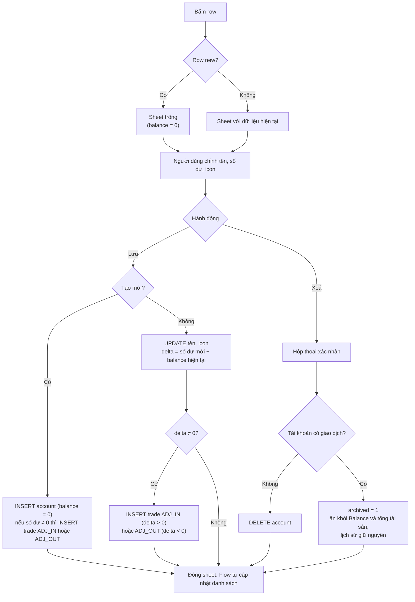

> Giao dịch điều chỉnh (`ADJ_*`) **không tính vào chart hay budget** và chỉ hiện trong lịch sử của tài khoản với nhãn "Điều chỉnh số dư". Nhờ đó số dư luôn bằng tổng các giao dịch và có thể kiểm tra lại được.

### 7.4 Category

#### Wireframe

```text
┌──────────────────────────────────────┐
│        ( ● Chi )    (  Thu  )        │  ← chuyển cây danh mục
│──────────────────────────────────────│
│  🍽  Ăn uống                       ⌄ │  ← cha: icon | tên | mũi tên
│  1.200.000              800.000 / 2.000.000 │  ← chỉ hiện khi có budget
│  ▓▓▓▓▓▓▓▓▓▓▓▓░░░░░░░░                │
│     🍜  Phở                          │  ← con (thụt lề)
│     ☕  Cafe                         │
│     -50.000        550.000 / 500.000 │  ← con cũng có thể có budget (đỏ)
│     ▓▓▓▓▓▓▓▓▓▓▓▓▓▓▓▓▓▓▓▓            │
│                 +                    │  ← thêm danh mục con
│──────────────────────────────────────│
│  🚗  Đi lại                        › │  ← đang thu gọn
│──────────────────────────────────────│
│                  +                   │  ← thêm danh mục cha
└──────────────────────────────────────┘
```

#### Quy tắc màu của budget

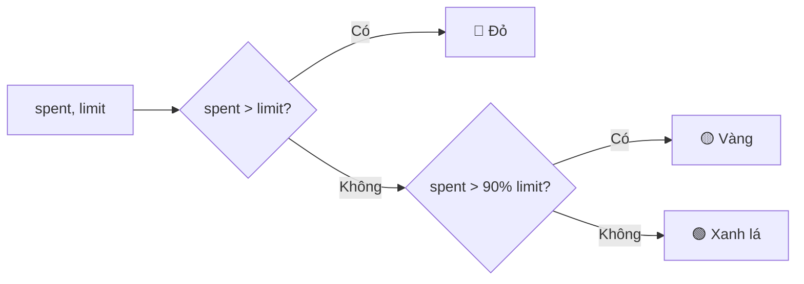

```kotlin
fun budgetColor(spent: Long, limit: Long): BudgetLevel = when {
    spent > limit            -> BudgetLevel.Over     // đỏ
    spent * 10 > limit * 9   -> BudgetLevel.Warning  // vàng  (> 90%, không dùng số thực)
    else                     -> BudgetLevel.Ok       // xanh lá
}
```

- **Hàng trên:** bên trái là `limit − spent` (có thể âm), tô theo màu trên. Bên phải là `spent / limit`.
- **Hàng dưới:** `LinearProgressIndicator(progress = min(spent / limit, 1f))`, cùng màu.
- Budget của **danh mục cha** tính tổng chi của **tất cả danh mục con** trong tháng hiện tại.
- Chỉ **danh mục Chi** mới có mục "Đặt budget" trong popup.

#### Popup sửa / tạo danh mục và quy tắc xoá

Popup gồm: tên, icon, budget theo tháng (để trống là không đặt budget), nút xoá.

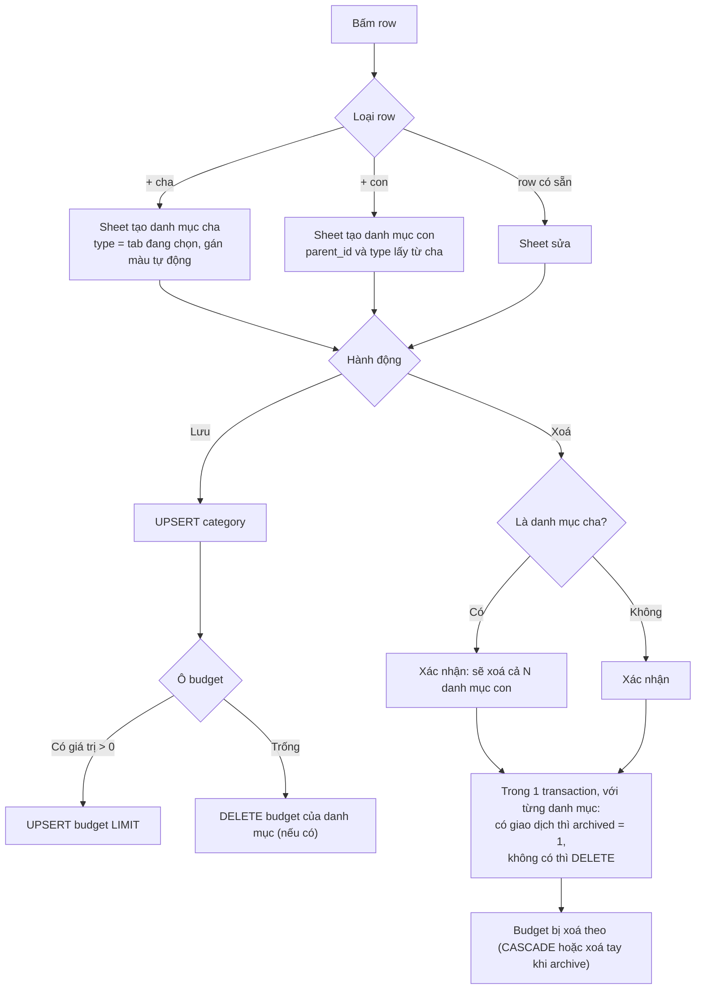

Mở hoặc thu gọn danh mục cha: trạng thái chỉ lưu trong `rememberSaveable` (tập id đang mở), không ghi xuống DB.

### 7.5 Mục tiêu tiết kiệm (budget SAVING)

Yêu cầu có budget tiết kiệm nhưng không nói rõ nó hiện ở màn nào. Đề xuất:

- **Tạo:** row "⊕ Thêm mục tiêu tiết kiệm" ở cuối danh sách budget trên Home. Popup gồm: tên, icon, **tài khoản tiết kiệm**, số tiền mục tiêu, hạn chót (không bắt buộc).
- **Cách tính tiến độ:** `saved = balance` của tài khoản được gắn. Người dùng tiết kiệm bằng cách **thêm giao dịch Thu** vào tài khoản đó, nên không cần thêm loại giao dịch mới.
- **Hiển thị:** `còn thiếu = target − saved`. Thanh tiến độ luôn dùng màu nhấn (không có đỏ/vàng). Nếu có hạn chót thì hiện thêm "cần ~X/tháng".

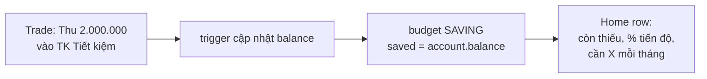

### 7.6 Analysis

Chỉ là màn giữ chỗ ("Sắp ra mắt"). Bảng `category_month_stat` đã sẵn sàng cho biểu đồ tròn và so sánh tháng về sau, không cần đổi schema.

### 7.7 Setting

| Nhóm | Mục |
|------|-----|
| Dữ liệu | Xuất backup, Khôi phục từ backup, Tự động backup (tuỳ chọn) |
| Hiển thị | Theme (Hệ thống / Sáng / Tối), ký hiệu tiền (`₫`), dấu phân cách hàng nghìn |
| Nhập liệu | Tài khoản mặc định, loại mặc định (Chi) |
| Icon | Quản lý icon đã import (xem, xoá icon không còn dùng) |
| Thông tin | Phiên bản, giấy phép (Phosphor Icons – MIT) |

Mọi setting lưu trong bảng `setting` (nên đi kèm trong file backup). Riêng `theme` được **ghi thêm** vào SharedPreferences để frame đầu vẽ đúng màu.

---

## 8. Icon: import PNG khi đang chạy

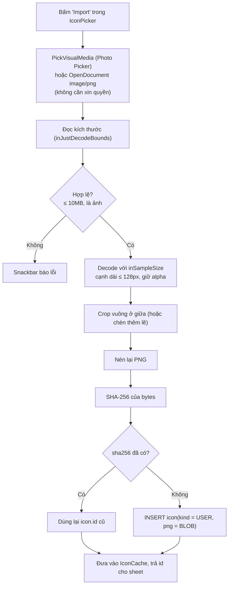

**Hiển thị icon:**

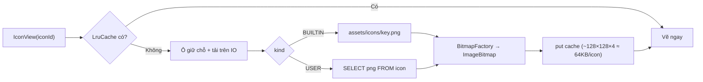

- Cache tối đa khoảng 8MB (khoảng 120 icon), thừa cho nhu cầu thực tế.
- Khi mở màn Trade, cache được nạp sẵn **10 icon của lưới** trong cùng lượt đọc dữ liệu picker.
- **Icon có sẵn** nằm trong `assets` (thuộc về app, không phải dữ liệu người dùng). Bảng `icon` chỉ lưu `asset_key` nên DB vẫn nhỏ. Sau khi restore sang máy khác, icon có sẵn vẫn hiển thị vì app nào cũng có bộ `assets` này.
- 100 icon người dùng import chiếm khoảng 0.5MB trong DB (mỗi file PNG 128px khoảng 3–8KB).

---

## 9. Backup & Restore

### 9.1 Xuất backup

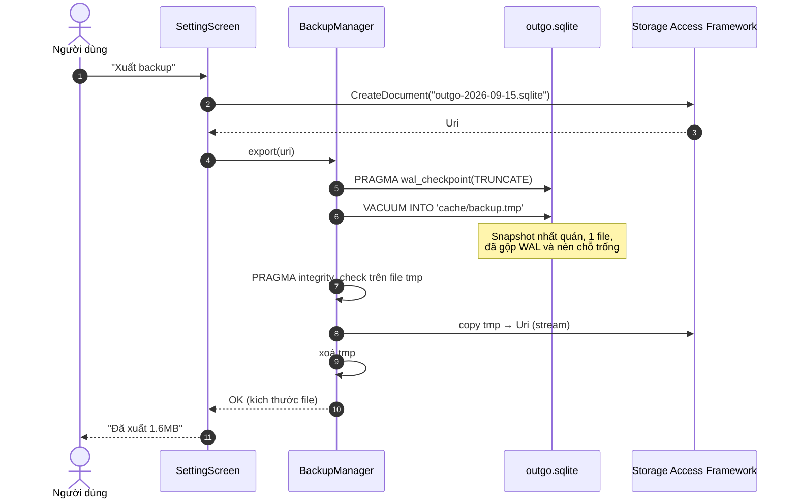

### 9.2 Khôi phục

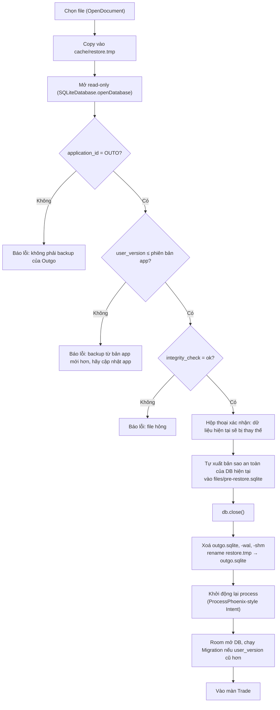

**Tự động backup (tuỳ chọn, tắt mặc định):** khi bật, người dùng chọn một thư mục (`OpenDocumentTree` + quyền truy cập lâu dài). App dùng WorkManager chạy hằng ngày, khi đang sạc, giữ lại 7 bản gần nhất. WorkManager chỉ **được khởi tạo khi bật tính năng này** (bỏ `InitializationProvider` trong manifest) để không làm chậm khởi động.

---

## 10. Lịch sử giao dịch lớn

- Có hai danh sách riêng **Chi** và **Thu** (route `history?type=`), mở từ Home. Cần thêm một danh sách theo tài khoản (lọc `account_id`), mở từ sheet tài khoản.
- **Phân trang theo keyset** thay cho `OFFSET`, nên tốc độ không giảm khi cuộn sâu:

```sql
SELECT t.*, c.name, c.icon_id, a.name AS account_name
FROM trade t
JOIN category c ON c.id = t.category_id
JOIN account  a ON a.id = t.account_id
WHERE t.type = :type
  AND (t.occurred_at, t.id) < (:lastOccurredAt, :lastId)   -- row-value, SQLite ≥ 3.15
ORDER BY t.occurred_at DESC, t.id DESC
LIMIT 50;
```

Kế hoạch truy vấn đã kiểm tra: `SEARCH trade USING COVERING INDEX idx_trade_list (type=? AND occurred_at<?)`.

```mermaid
sequenceDiagram
    participant L as LazyColumn
    participant P as KeysetPagingSource
    participant D as TradeDao
    L->>P: load(key = null)
    P->>D: page đầu (LIMIT 50)
    D-->>P: 50 rows
    P-->>L: data, nextKey = (occurred_at, id) của dòng cuối
    L->>P: load(nextKey) khi còn cách cuối 20 item
    P->>D: WHERE (occurred_at, id) < nextKey
    D-->>P: 50 rows
    P-->>L: append
    Note over L,D: Khi bảng trade thay đổi, Room InvalidationTracker<br/>làm PagingSource cũ vô hiệu và nạp lại từ vị trí đang xem
```

- Danh sách có **header theo ngày** kèm tổng tiền của ngày (tính trong page nhận về). Dùng `key = trade.id` và `contentType` để Compose tái sử dụng item.
- Bấm vào một giao dịch mở `trade/edit/{id}`, dùng lại `TradeScreen` ở chế độ sửa (có nút xoá). Trigger tự điều chỉnh mọi số liệu.

**Ước lượng dung lượng:** mỗi giao dịch khoảng 80–120 byte cả index, nên **100.000 giao dịch ≈ 10–12MB**. Nếu mỗi ngày nhập khoảng 10 giao dịch trong 10 năm (khoảng 36.500 giao dịch), DB chỉ khoảng 4MB.

---

## 11. Hiệu năng: chỉ tiêu & kỹ thuật

| Chỉ tiêu | Mục tiêu | Cách đo |
|----------|----------|---------|
| Cold start, TTFF | < 400ms (máy tầm trung) | Macrobenchmark `StartupTimingMetric` |
| Cold start, TTFD (lưới đã có dữ liệu) | < 600ms | `reportFullyDrawn()` |
| Warm start | < 150ms | Macrobenchmark |
| Lưu một giao dịch | < 20ms (gồm cả trigger) | Microbenchmark DAO |
| Cuộn lịch sử (100k giao dịch) | Không bị giật (P90 frame < 16ms) | `FrameTimingMetric` |
| Kích thước APK (arm64, release) | < 5MB | `bundletool get-size` |
| RAM khi mở màn Trade | < 60MB PSS | `dumpsys meminfo` |

**Danh sách kiểm tra:**

- [ ] Baseline Profile sinh ra từ các hành trình: mở app → nhập tiền → chọn danh mục → lưu, chuyển qua các tab, cuộn lịch sử.
- [ ] Không có I/O trên main thread (`StrictMode` bật trong bản debug).
- [ ] `UiState` dùng lớp `@Immutable` và `ImmutableList` (kotlinx.collections.immutable) để Compose bỏ qua recomposition không cần thiết.
- [ ] Mọi `Flow` từ Room đều qua `distinctUntilChanged()` và `stateIn(WhileSubscribed(5_000))`.
- [ ] Không dùng `material-icons-extended`, Coil, Hilt hay thư viện chart.
- [ ] R8 full mode, `shrinkResources`, `resourceConfigurations = ["vi", "en"]`.
- [ ] Mỗi lần nhấn LƯU chỉ tạo một transaction.

---

## 12. Kiểm thử

```mermaid
flowchart LR
    U["Unit (JVM)<br/>MoneyFormat, MonthKey,<br/>budgetColor, chart layout,<br/>thuật toán gợi ý"] --> I
    I["Instrumented DB (Room in-memory)<br/>trigger: đối chiếu balance, stat, use_count<br/>với truy vấn tính lại từ đầu sau N thao tác ngẫu nhiên<br/>Migration test mọi phiên bản"] --> C
    C["Compose UI test<br/>Trade: lưu xong reset form, vẫn ở Trade<br/>Amount: không nhận '-'"] --> M
    M["Macrobenchmark<br/>startup, cuộn history<br/>chạy trên máy thật trong CI"]
```

Trong các test trên, **kiểm tra bất biến của trigger** quan trọng nhất: sau một loạt insert, update, delete ngẫu nhiên, `account.balance`, `category_month_stat` và `use_count/last_used_at` phải trùng với kết quả `GROUP BY` tính lại trực tiếp từ bảng `trade`.

---

## 13. Lộ trình

```mermaid
gantt
    title Lộ trình v1
    dateFormat YYYY-MM-DD
    axisFormat %d/%m
    section Nền tảng
    Khung dự án, theme, nav, DI           :m1, 2026-09-21, 4d
    Schema + trigger + DAO + test          :m2, after m1, 5d
    section Tính năng
    Trade (màn khởi động)                  :m3, after m2, 6d
    Balance + sheet tài khoản              :m4, after m3, 3d
    Category + budget LIMIT                :m5, after m4, 5d
    Icon import + IconPicker               :m6, after m4, 4d
    Home + chart + SAVING                  :m7, after m5, 6d
    History + sửa/xoá giao dịch            :m8, after m7, 4d
    Setting + Backup/Restore               :m9, after m8, 4d
    section Hoàn thiện
    Baseline Profile + đo hiệu năng        :m10, after m9, 3d
    Sửa lỗi, chuẩn bị phát hành            :m11, after m10, 4d
```

---

## 14. Giả định & câu hỏi mở

| # | Giả định hiện tại | Cần xác nhận |
|---|-------------------|--------------|
| A1 | Một loại tiền (VND), không có phần thập phân | Có cần nhiều loại tiền không? Nếu có, thêm `account.currency` và `exponent` |
| A2 | Budget tính theo **tháng dương lịch** | Có cần "tháng bắt đầu từ ngày nhận lương"? `month_key` sẽ phải tính theo ngày bắt đầu |
| A3 | Không có chuyển tiền giữa tài khoản | Nếu cần, thêm `type = TRANSFER` và cột `to_account_id`, trigger cập nhật cả hai tài khoản và không tính vào chart |
| A4 | Giao dịch Thu/Chi chỉ gắn với danh mục **con** | Danh mục cha không có con thì có được chọn không? |
| A5 | Hàng 2 của lưới bỏ các mục đã có ở hàng 1 | Hay hiển thị đúng top 5 kể cả trùng? |
| A6 | Lưu xong thì reset **tất cả** về mặc định (kể cả Thu/Chi và tài khoản) | Khi nhập nhiều giao dịch liên tục, có muốn giữ lại Thu/Chi và tài khoản không? |
| A7 | Mục tiêu tiết kiệm = số dư của một tài khoản được gắn | Hay đóng góp qua một danh mục "Tiết kiệm" riêng? |
| A8 | Bottom bar có 6 tab, chỉ hiện nhãn tab đang chọn | Hay chuyển Setting vào icon ⚙ trên Home để còn 5 tab? |
| A9 | `month_key` cố định theo múi giờ lúc nhập | Người hay đi nước ngoài có thể thấy lệch ngày ở ranh giới tháng, chấp nhận được với v1 |
