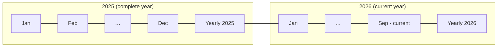

# Analysis v2 — plan

Status: **plan only, nothing implemented.** Supersedes the shipped Analysis screen
(`feat/analysis-rebuild`, one page per month, expense-only).

## 1. Why

The screen as shipped answers one question — *where did my expense go this month* — and never
mentions income or transfers. This plan widens it to all three trade kinds and adds a year level,
keeping the priority **expense > income >>> transfer**.

Two things change structurally:

- every mode-capable chart is driven by one **Expense / Income / All** switch;
- the pager gains a **Yearly analysis** page at the end of each year's months.

## 2. Decisions (locked)

| # | Decision | Chosen |
|---|---|---|
| D1 | Mode switch scope | One switch per page, drives every mode-capable section |
| D2 | Switch placement | Scrolls with the content, first item above the summary |
| D3 | "All" means | Expense and income drawn together (two series), plus net |
| D4 | Transfers | One compact section near the bottom + one line in the summary |
| D5 | Expense-only sections | Daily heatmap, Spend by weekday, Purchase size mix |
| D6 | Year pages | One `Yearly` page after each year's months, in the same flat pager |
| D7 | Month pages per year | All 12 (current year: Jan … current month), empty months keep their empty states |
| D8 | Year caret target | Same month in the target year; `Yearly` → `Yearly`; fall back to the nearest existing page |
| D9 | "Now" button | Jumps to today's month from anywhere; disabled when already there |
| D10 | Year page content | Year summary + 12-month bars, category totals, year-over-year, yearly transfers + largest |
| D11 | Left caret on January | Previous year's `Yearly` page (flat pager order) |

## 3. Navigation

### 3.1 Page model

One flat `HorizontalPager`. Pages are a sealed type, not just ints:

```kotlin
sealed interface AnalysisPage {
    data class Month(val monthKey: Int) : AnalysisPage   // 202609
    data class Year(val year: Int) : AnalysisPage        // 2026
}
```

Order — each year contributes its months, then its year page:



- The first page is January of the earliest year that has any data (D7).
- The current year stops at the current month; no future month pages.
- Every year that has a month page also has exactly one `Yearly` page, directly after its last month.
- The left caret on January moves to the *previous year's* `Yearly` page — the plain flat order
  (confirmed). On the earliest year's January it is disabled, because there is no earlier page.

### 3.2 Header

Two rows, above the scrolling content.

```
┌──────────────────────────────────────────────────────┐
│  ‹  2026  ›                        [ Yearly analysis ]│  row 1
│  ‹  September analysis  ›                      [ Now ]│  row 2
├──────────────────────────────────────────────────────┤
│  [ Expense | Income | All ]        ← scrolls away     │
│  Summary …                                            │
└──────────────────────────────────────────────────────┘
```

**Row 1 — year.** Left caret / selected year / right caret, left-aligned; one button right-aligned.

| Control | Behaviour | Disabled when |
|---|---|---|
| `‹` | Same month in the previous year; from a `Yearly` page → previous year's `Yearly` (D8). Falls back to the nearest existing page in that year when the same month does not exist (e.g. Nov 2025 → the current year has no Nov, so land on the current month). | No earlier year has data |
| year label | Static text, the year of the current page | — |
| `›` | Mirror of `‹` | No later year exists |
| `Yearly analysis` | Jumps to the selected year's `Yearly` page | Already on it |

**Row 2 — month.** Same shape.

| Control | Behaviour | Disabled when |
|---|---|---|
| `‹` | Previous page in flat order. On January this is the previous year's `Yearly` page. | On the very first page |
| label | `<Month> analysis`, or `Yearly analysis` on a year page | — |
| `›` | Next page in flat order. On the last month of a year this is that year's `Yearly` page (your "swipe right at the last month"). | On the very last page |
| `Now` | Jumps to today's month page (D9) | Already on it |

A horizontal swipe does exactly what the row-2 carets do. Both carets and both buttons dim to 30%
when disabled, as the shipped arrows already do. Haptic tick on every settled page change, as today.
Swiping past either end shows the default pager overscroll.

### 3.3 Mode switch

`[ Expense | Income | All ]`, a segmented control, first item of the page's `LazyColumn` (D2).
State lives per page and resets to `Expense` when the page is disposed. Sections that do not follow
the switch (D5) are **hidden entirely** in Income mode rather than shown with empty data, and shown
normally in Expense and All.

## 4. What each mode draws

| Section | Expense | Income | All (D3) |
|---|---|---|---|
| Summary | Spend + change + per day | Income + change + per day | Both + **net**, emphasised |
| Donut | Expense categories | Income categories | Two rings: expense outer, income inner |
| Breakdown | Expense rows | Income rows | Grouped: expense rows, then income rows |
| Pace | Cumulative expense | Cumulative income | Two lines (red/green) + a faint net line |
| 6-month trend | Expense bars | Income bars | Diverging bars: income up, expense down, net line |
| Movers | Expense categories | Income categories | Both, tagged by kind |
| Largest | 5 biggest purchases | 5 biggest incomes | 5 biggest movements of either, coloured by kind |
| Heatmap · Weekday · Size mix | Expense | *hidden* | Expense |
| Transfers | Always shown, unaffected by the switch | | |

Colour rules are unchanged: `ExpenseRed`, `IncomeGreen`, category `color`, `TransferBlue` for the
transfer section. More spending stays red, less stays green; for income the sense flips (more income
is green), so the delta colouring becomes kind-aware.

## 5. Month page — sections

Order top to bottom. ★ = follows the mode switch.

| # | Section | Source | Notes vs. today |
|---|---|---|---|
| 0 | Mode switch | — | New |
| 1 | ★ Summary | STATS | Adds an income line, a net line and a transfer line (D4) |
| 2 | ★ Donut | STATS | Per-chart toggle removed; two rings in All mode |
| 3 | ★ Breakdown | STATS | Kind-aware delta colours; grouped in All mode |
| 4 | ★ Pace | TRADES | Second series in All mode |
| 5 | ★ 6-month trend | STATS | Diverging bars in All mode |
| 6 | ★ Movers | STATS | Now available for income categories |
| 7 | Daily heatmap | TRADES | Expense-only (D5), hidden in Income mode |
| 8 | Spend by weekday | TRADES | Expense-only (D5) |
| 9 | Purchase size mix | TRADES | Expense-only (D5) |
| 10 | ★ Largest | TRADES | Income mode lists biggest incomes |
| 11 | Transfers | TRADES | **New.** Month total, count, top 5 account pairs `From → To` |

Every section keeps a fixed height per state, so the skeleton, the empty state and the loaded state
are interchangeable. A hidden section (D5 in Income mode) removes its height — that only happens on
an explicit mode tap, never while data loads.

## 6. Year page — sections

| # | Section | Source | Content |
|---|---|---|---|
| 0 | Mode switch | — | Same control, same modes |
| 1 | ★ Year summary | STATS | Year total, average per month, biggest and smallest month, net, transfer line. Partial for the current year (year-to-date), labelled as such |
| 2 | ★ 12-month bars | STATS | One bar per month + dashed average line. Tapping a bar jumps to that month's page |
| 3 | ★ Year donut + breakdown | STATS | 12 months summed per parent category, each row's change vs. the **same period last year** |
| 4 | ★ Year-over-year | STATS | Cumulative line for this year vs. last year, plus expense / income / net per year |
| 5 | Year transfers | TRADES | Top account pairs for the year, total and count |
| 6 | ★ Year largest | TRADES | 5 biggest movements of the year |

The current year's page compares like-for-like: year-to-date against the same months of last year,
never a full 12 months against 9.

## 7. Data layer

No schema change, no migration, no new index. `trade(month_key, type)` and
`category_month_stat(month_key)` still cover everything.

### 7.1 STATS (`category_month_stat`, live)

`observeMonthlyTotals(from, to)` already returns both kinds — the shipped screen simply filtered
income out. Ranges:

| Page | Observed range | Feeds |
|---|---|---|
| Month `m` | `m − 6 … m + 1` (unchanged) | 1, 2, 3, 5, 6 |
| Year `y` | `y−1 Jan … y Dec` (24 months) | 1, 2, 3, 4 |

24 rows-per-category-per-month is still a small result; it is built into UI models in one `map` on
`Dispatchers.Default`, as today.

### 7.2 TRADES (raw, one-shot)

The shipped query is expense-only. Widen it by one parameter rather than adding a query:

```sql
SELECT id, amount, type, occurred_at AS occurredAt, category_id AS categoryId, note
FROM trade
WHERE type IN (:types) AND month_key IN (:monthKeys)
```

- `types` is `(0, 1)` — EXPENSE and INCOME. `type` joins the projection so one pass can split them.
- Month page: `lastN(month, 3)` as today (covers the previous month and the 3-month weekday window).
- Year page: the 12 (or 24, for section 4) month keys of the year.

Transfers need a separate, tiny aggregate — they have no category, so nothing about them can come
from `category_month_stat`:

```sql
SELECT account_id AS fromAccountId, to_account_id AS toAccountId,
       COUNT(*) AS count, SUM(amount) AS total
FROM trade
WHERE type = 4 AND month_key IN (:monthKeys)
GROUP BY account_id, to_account_id
ORDER BY total DESC
```

Account names come from `AccountRepository.observeAll`, the same way category names already do.

### 7.3 Aggregation

`AnalysisAggregate.kt` stays pure Kotlin (no Android, JVM-testable). Changes:

- `buildStats(totals, month, …)` returns both kinds instead of dropping income, plus a `net`.
- `buildTrades(rows, …)` splits by `type` in the existing single pass; heatmap, weekday and buckets
  keep reading only the expense half.
- New `buildYear(totals, year, …)` and `buildYearTrades(rows, transfers, year, …)`.
- New `buildTransfers(rows, accounts)`.

### 7.4 UI models

All `@Immutable`, all precomputed. Existing models grow a kind or a second series:

| Model | Change |
|---|---|
| `SummaryUi` | `+ incomeDelta`, `+ transferTotal`, `+ transferCount`, `+ netDelta` |
| `DonutUi` | `+ innerSlices` for the All-mode second ring |
| `BreakdownRow` | `+ kind` (expense/income), drives the delta colour |
| `PaceUi` | `+ incomeCurrent`, `+ incomePrevious` |
| `TrendBar` | `+ incomeAmount`, `+ incomeFraction` for diverging bars |
| `MoverRow` | `+ kind` |
| `LargestItem` | `+ kind` |
| *new* `TransferPair` | `fromName, toName, total, count, fraction` |
| *new* `YearSummaryUi`, `YearBars`, `YoyUi` | Year page |

## 8. Performance

Unchanged in approach; extended to the new page type.

- **Windowing.** `beyondViewportPageCount = 1` still means exactly three pages composed. A year page
  is one more page, not a special case.
- **Staged loading.** Unchanged: STATS renders immediately, TRADES starts after the page's first
  frame, fixed-height skeletons until then. The year page's TRADES stage covers 12 months instead of
  3 — measurably bigger, still one query, still off the main thread.
- **Cache.** The LRU keys on `AnalysisPage`, not on `Int`, so a year page and a month page can both
  sit in the same 5-entry cache. Neighbour prefetch on settle is unchanged; prefetching *into* a year
  page is what makes the swipe from December feel instant.
- **Mode switch.** Switching mode must not re-query. All three modes are computed in the same pass
  and held in one model; the switch only picks which precomputed series a section reads. This is the
  main reason the models carry both kinds rather than being rebuilt per mode.
- **Launch.** Unchanged: nothing in Analysis is touched before its tab is first shown.
- `LazyLayoutCacheWindow` is still unavailable at Compose Foundation 1.7.0 (BOM 2024.09.02); default
  prefetch as before, no upgrade for this.

## 9. UX, accessibility, strings

- Every chart keeps a `contentDescription` summary; the All-mode ones state both figures
  ("Spent 1,960 $, earned 3,200 $, 1,240 $ left").
- The mode switch is a labelled segmented control, so its state is announced.
- Every new string lands in `values/strings.xml` **and** `values-vi/strings.xml`.
- Both themes verified for the new two-series charts, where red and green sit next to each other.
- Month names already exist as `R.array.month_abbrev`; the row-2 label needs a full month name array
  (new, both locales).

## 10. Files

**Add**

| File | Why |
|---|---|
| `ui/analysis/AnalysisPage.kt` | Sealed page type + the flat page list and its caret/jump rules |
| `ui/analysis/YearPage.kt` | Year page composable and its sections |
| `ui/analysis/AnalysisMode.kt` | Enum + the segmented control |
| `app/src/test/…/AnalysisYearTest.kt` | Year aggregation, year-over-year alignment, page-order and caret rules |

**Change**

| File | Why |
|---|---|
| `data/db/dao/TradeDao.kt` | `types` parameter; new transfer aggregate query |
| `data/db/dao/QueryModels.kt` | `TradeSlim.type`; new `TransferTotal` |
| `data/repo/TradeRepository.kt` | Pass-throughs |
| `ui/analysis/AnalysisAggregate.kt` | Both kinds, transfers, year builders |
| `ui/analysis/AnalysisModels.kt` | Model changes in §7.4 |
| `ui/analysis/AnalysisViewModel.kt` | Page-keyed cache, year ranges, account names |
| `ui/analysis/AnalysisScreen.kt` | Two header rows, page-typed pager |
| `ui/analysis/AnalysisSections.kt` | Mode-aware sections, transfer section |
| `ui/analysis/AnalysisCharts.kt` | Two-series donut / pace / trend, diverging bars |
| `res/values/strings.xml`, `res/values-vi/strings.xml` | New strings, full month names |
| `baselineprofile/…/BaselineProfileGenerator.kt` | Journey: open Analysis, swipe a month, open Yearly, tap a mode |
| `README.md` | Feature list |

**Delete** — nothing. The shipped sections are extended, not replaced.

## 11. Phases

Each phase ends with `gradlew.bat assembleDebug` + `gradlew.bat :app:testDebugUnitTest` green.

1. **Data.** `types` parameter, transfer query, both kinds through `buildStats`/`buildTrades`,
   transfer aggregation. Unit tests for the new maths first.
2. **Navigation.** `AnalysisPage`, the flat page list, the two header rows, carets, `Now` and
   `Yearly analysis` buttons, page-keyed cache. Year page renders a placeholder.
3. **Mode switch.** Control + mode-aware month sections 1, 2, 3, 6, 10; hide D5 sections in Income.
4. **Two-series charts.** All-mode donut, pace and trend.
5. **Transfers.** Section 11 + the summary line.
6. **Year page.** Sections 1–6 of §6.
7. **Cleanup + report.** Dark mode, Vietnamese, empty months, empty years, baseline profile journey.

## 12. Open questions / risks

1. **Year page for a partial current year** — planned as year-to-date with a label; confirm that
   reads right in January, when the year page is nearly empty.
2. **Income "movers" and "largest"** are only useful with several income categories; a single
   "Salary" category makes both sections trivial. Worth a look once it is on screen.
3. **Transfers between archived accounts** — the pair needs a name; falls back to the stored account
   row, which still exists after archiving.
4. **Year TRADES stage cost** — 12 months of rows in one query. Expected fine (a heavy year is a few
   thousand rows), but it is the one number worth measuring rather than assuming.
